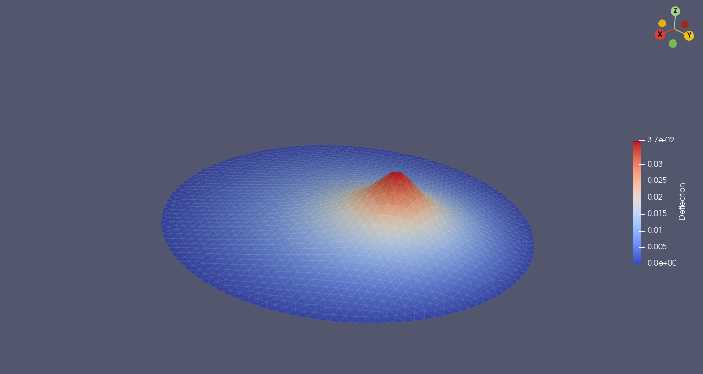

# FEniCSx Learning & Exploration

This repository documents my journey in learning FEniCSx — the next-generation open-source computing platform for solving partial differential equations (PDEs) using the finite element method (FEM).

The repository will include:

- Code examples for different PDE problems
- Mini-projects to practice solving real-world PDEs
- Experiments with custom meshes, boundary conditions, and solvers.

## 📅 Learning Plan

### Phase 1 - Foundations

**Goal:** Get familiar with FEniCSx basics and the Python API.

- [x] Install FEniCSx, mshr, Paraview
- [x] Poisson Equation (Basic Example - Complex Example)
- [x] Deflection of a membrane (Unit Circle)

  
  

**Comments:** The easiest way to install FEniCSx in a virtual environment is through Anaconda. ParaView offers high-quality images for PDE visualization.

📚 **Resources:**

- [The FEniCSx tutorial](https://jsdokken.com/dolfinx-tutorial/index.html)
- [DOLFINx documentation](https://docs.fenicsproject.org/dolfinx/main/python/index.html)
- [Automated Solution of Differential Equations by the Finite Element Method -
The FEniCS Book](https://link.springer.com/book/10.1007/978-3-642-23099-8)
